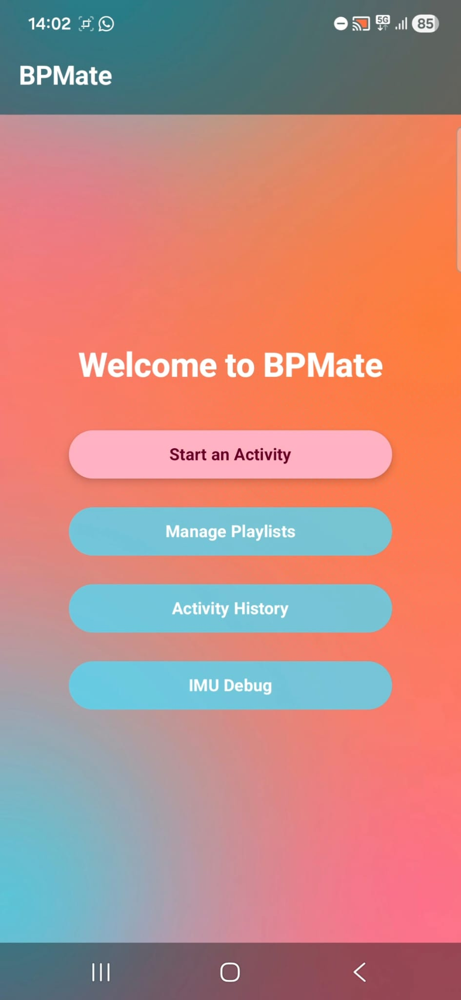
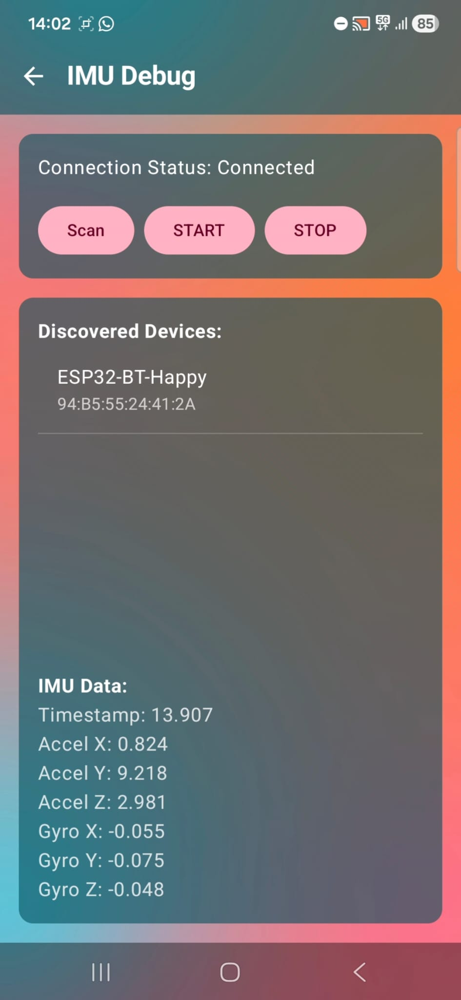
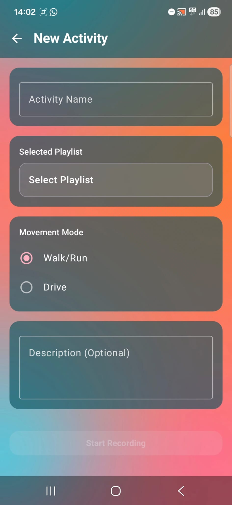
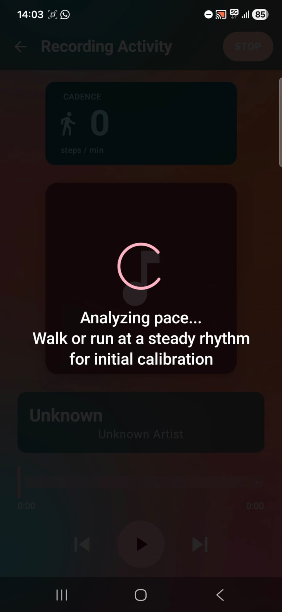
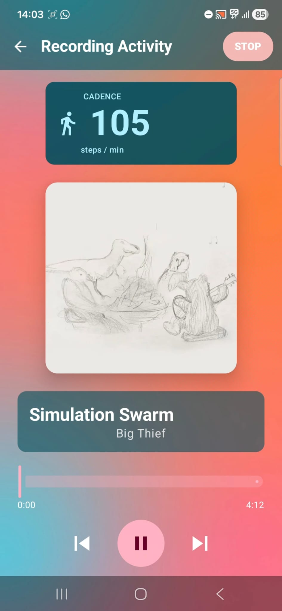
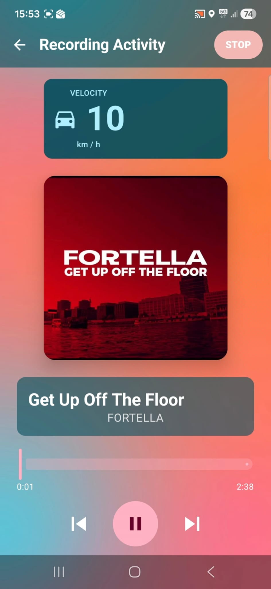
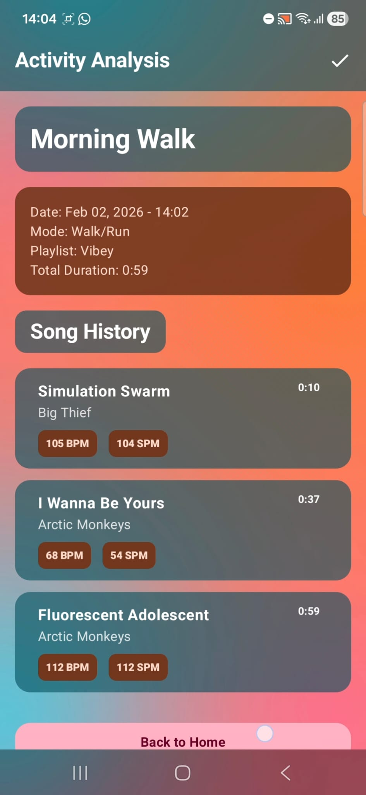
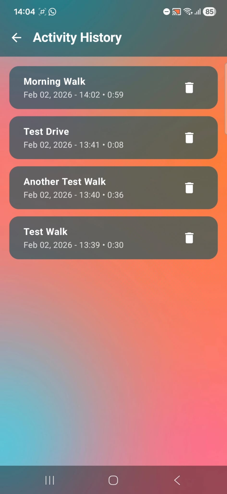
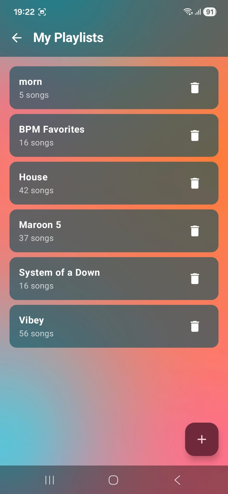
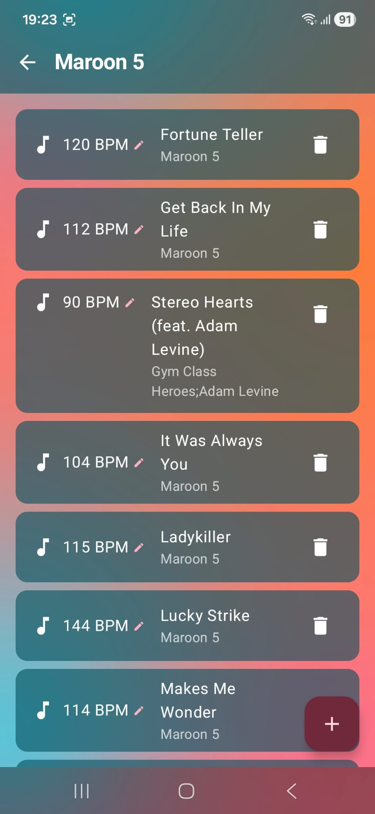

# 🎧 BPMate — Music That Matches Your Pace

BPMate is an Android app that plays **local music files** that fit your **movement speed (cadence)**.  
It supports **Bluetooth streaming from an ESP32 + IMU** and saves your sessions to a **local database** for later review.

---

## ✨ Highlights

- 🎵 **Local music player** (no streaming required)
- 🏃‍♂️ **Live cadence/velocity** display during recording
- 📶 **Bluetooth IMU input** (ESP32 + sensor)
- 🗂️ **Playlists** built from on-device audio files
- 💾 **Activity history + analysis** (summary + songs played)
- 🧪 **IMU Debug** screen for validating sensor streaming

---

## 📸 Screenshots

| Home | IMU Debug | Create Activity |
|---|---|---|
|  |  |  |

| Initial Calibration | Player (Walking/Running) | Player (Driving) | Activity Analysis |
|---|---|---|---|
|  |  |  |  |

| Activity History | Playlist Management Screen | Playlist Editing |
|---|---|---|
|  |  |  |

---

## 🧭 How to use BPMate

### 1) Create a playlist 🎶
Go to **Playlist Management**:
- Create a playlist
- Add songs from your device
- Remove songs when needed

### 2) Start an activity 🏁
Go to **Create Activity**:
- Set a name
- Choose a mode: **Walk/Run** or **Drive**
- Pick a playlist
- Add an optional description

> Note: In order to use walk/run mode, you need to first enter the `IMU Debug` screen and connect your ESP.

### 3) Record & listen ▶️
On the **Player / Recording** screen:
- Play/pause/skip songs
- See the current song details
- Watch your **cadence (steps/min)** or **speed (km/h)** update live
- Press **Stop and Save** when finished

### 4) Review results 📊
- **Analysis**: session summary + the list of songs played
- **History**: browse past activities and reopen their analysis

---

## 📶 Bluetooth + IMU (ESP32) setup

BPMate can receive IMU samples over Bluetooth from an ESP32 device.

**Recommended workflow:**
1. Pair the phone with the ESP32 (Android Bluetooth settings)
2. Open **IMU Debug** and confirm that sensor values change
3. Start an activity and verify that cadence updates on the Player screen

---

## 🗃️ What gets saved

BPMate stores:
- Activity details (name, mode, playlist, timestamps, optional description)
- The list of songs played during the activity
- The playlists you create

This allows for a smooth listening experience, and enables session analysis and activity history without any cloud services.

---

## 🔐 Permissions

Depending on Android version, BPMate may request:
- 📶 Bluetooth permissions (scan/connect)
- 📍 Location permission (required for driving mode and Bluetooth discovery on some versions)
- 🎵 Media/files permission (to read local audio)

---

## 🧯 Troubleshooting

- **Cadence stays at 0**  
  → Open **IMU Debug** and make sure IMU values are updating.

- **No songs appear / playlists are empty**  
  → Check media permission and confirm the files exist locally on the device.

- **ESP32 doesn’t show up**  
  → Ensure Bluetooth is enabled, the device is paired, and try scanning again.

---
